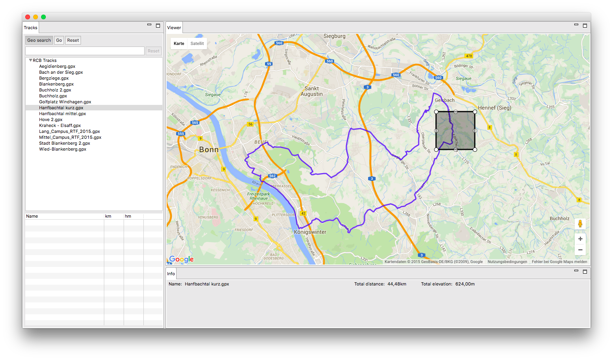
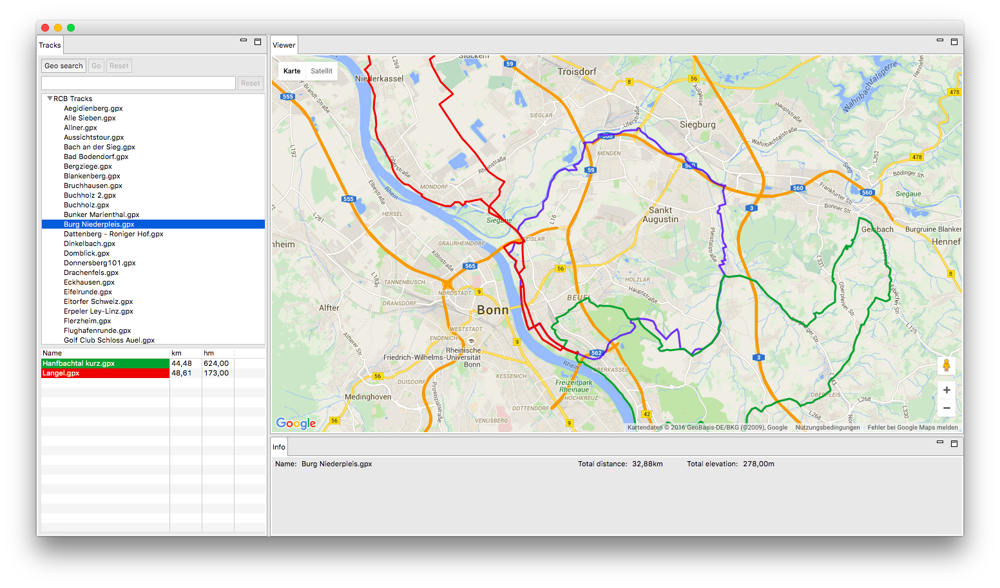

# Track Explorer
Track Explorer is a program which helps you exploring your GPX tracks.

It is build with the help of the Eclipse Rich Client Platform, making heavy use of the Java 8 Stream API.

## Key features
### Search tracks by location
Display only the tracks which pass through a particular region.

### Show several tracks at once
Select several tracks to be shown at once.

## Downloads

## User Guide
### Add tracks
Mac: Open preferences by clicking on `Track Explorer -> Preferences`.

Windows: Click on `File -> Settings`.

Add a location by clicking on `New`. All files ending on `.gpx` in this location will be added.

### Geographical search
Click on `Geo Search`. A rectanlge will appear. This is the region a track must pass in order to be included in the results.
You can move and resize the region.

To start a search, click on `Go`.

`Reset` will create a new rectangle on the center of the screen.

To disable the search, click on `Geo Search`.

### Filter tracks
Just type in the box above the track list.
The tracks will be filtered according to the input.

### Display several tracks at once
To select a track for permanent display, right click on the trick and select `Add track permanently`. The track will move to the list in the bottom.

To stop displaying a track permanently, select the track in the bottom list and press delete.

## Build notes
To be able to do multi-platform builds, please have a look at:
https://wiki.eclipse.org/Building#Preferred_way_of_doing_multi-platform_builds